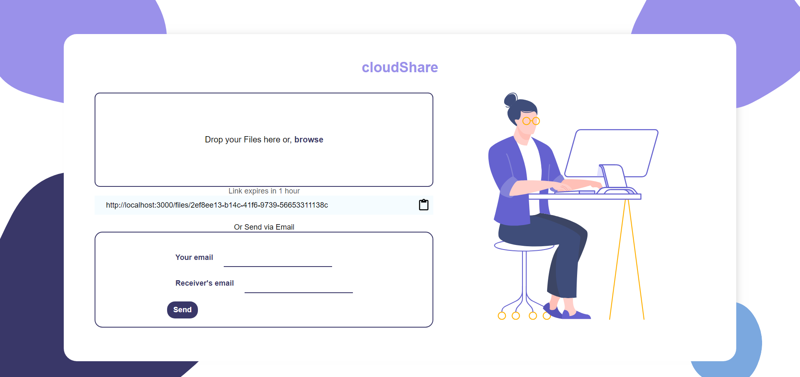
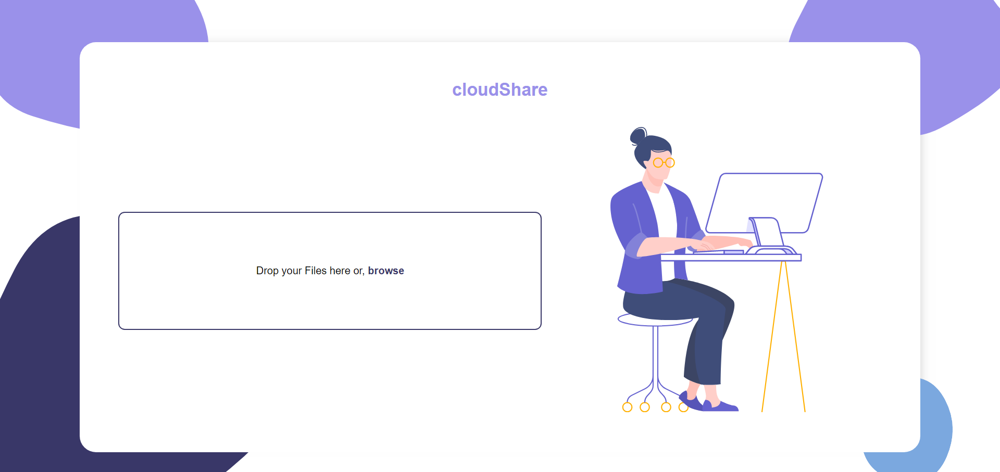
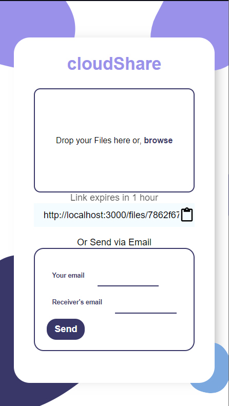
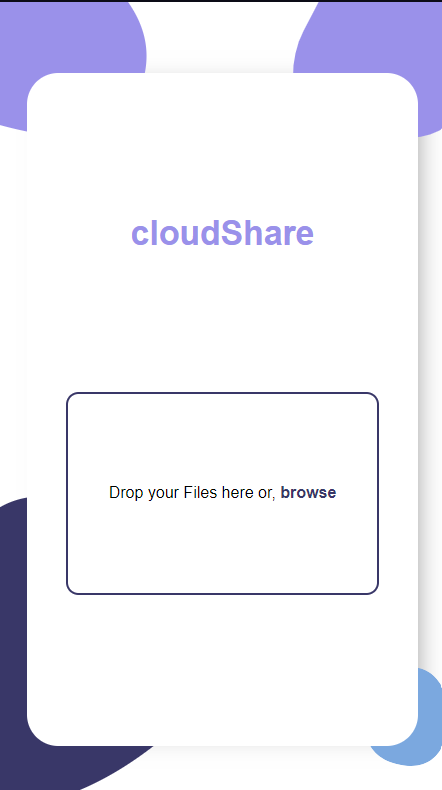

# cloudShare
This project was built to store and share file via cloud. It is powered by a restful api. Yo can uplaod a file upto 50MB and you can email the file's remote link to your desired recipent.
The file stays in database for 2 hours.

##

```
NPM packages used
- dotenv
- ejs
- express
- nodemon

```

For Live demo, [click here:](https://recipie-search-app.netlify.app/)

## Screenshots





